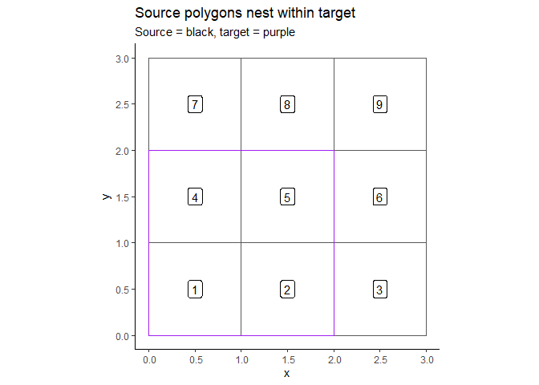
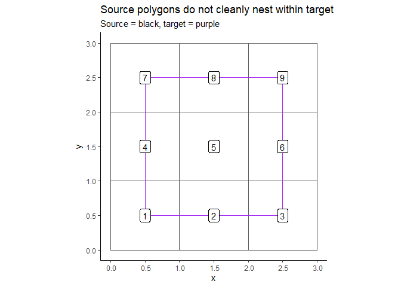
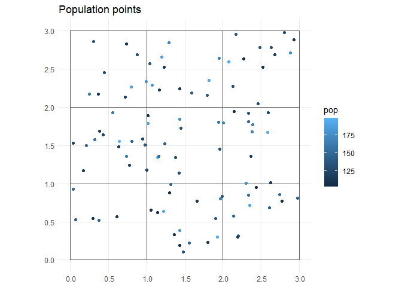
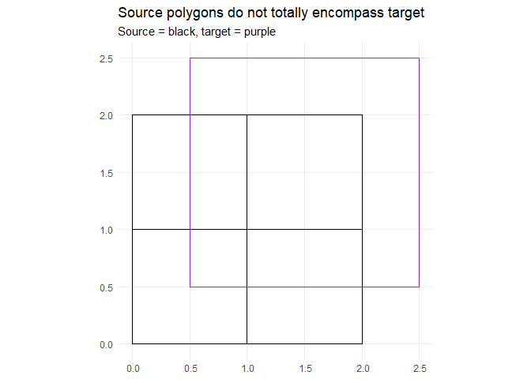

README
================

- <a href="#spatagg" id="toc-spatagg">spatagg</a>
- <a href="#things-to-be-aware-of" id="toc-things-to-be-aware-of">THINGS
  TO BE AWARE OF</a>
- <a href="#other-fun-doodads" id="toc-other-fun-doodads">Other fun
  doodads</a>
- <a href="#installation" id="toc-installation">Installation</a>
- <a href="#examples" id="toc-examples">Examples</a>
  - <a href="#construct-test-geographies"
    id="toc-construct-test-geographies">Construct test geographies</a>
  - <a href="#geographic-overlap-aggregation"
    id="toc-geographic-overlap-aggregation">Geographic Overlap
    Aggregation</a>
  - <a href="#point-population-overlap"
    id="toc-point-population-overlap">Point population overlap</a>
  - <a href="#propagating-uncertainty"
    id="toc-propagating-uncertainty">Propagating uncertainty</a>
  - <a href="#when-source-doesnt-totally-cover-target"
    id="toc-when-source-doesnt-totally-cover-target">When source doesn’t
    totally cover target</a>

## spatagg

spatagg provides functions for the aggregation of estimates between
non-nesting geographies. For example, “converting data at the census
tract level to the ZIP code level.

Two main approaches are provided:

1.  Geographic/Fractional Approach: A target geography value is
    constructed from overlapping source geographies based on fractional
    overlap. If target T is covered 60/40 by geographies A and B, then:
    $T = .6A + .4B$

2.  Point weighted population: Instead of using geographic overlap as
    the weights for aggregation (e.g. #1), the population overlap is
    used instead. THIS IS THE ONE YOU USUALLY WANT TO USE!

## THINGS TO BE AWARE OF

1.  BEWARE OF EDGE EFFECTS, especially when using the point pop option.
    Things like ZIP codes cross county boundaries. It is usually best to
    double check those and/or mix and match geographic or point pop
    crosswalks. For ZIP codes specifically, I think this generally means
    all estimates in ZIPs that cross the boundary will be fully assigned
    to intersecting targets within King County. This may or may not be
    what you want.
2.  BEWARE OF WATER, especially when using geographic overlap. In
    general, make sure source and target have similar ideas of what
    consists of land
3.  THE `proportion` ARGUMENT IN CROSSWALK IS NOT JUST FOR proportion
    data. Basically, if your data is not a count, set `proportion = T`.
4.  Don’t forget the rescale option exists.

## Other fun doodads

1.  The function `assign_cases` can take a set of crosswalk instructions
    and probabilistically apply it to microdata.
2.  The function `reduce_overlaps` can be used to fix up geographies (in
    some cases) so that `check_internal_consistency` quiets down.
3.  Review the [validation vignette](spatagg_validate.md) to see how
    geographic overlap compares to population based ones

## Installation

For now, you will need to have a github PAT (or similar) with
permissions to access PHSKC-APDE private repos.

``` r
# You will need the remotes package
remotes::install_github('https://github.com/PHSKC-APDE/spatagg')

# You may also want to install the kcparcelpop package
# Useful for population weighted aggregation
remotes::install_github('https://github.com/PHSKC-APDE/kcparcelpop/')
```

## Examples

### Construct test geographies

The code below creates a 3 x 3 grid of squares as a set of “source”
polygons. The source polygon contains the information that needs to be
translated/aggregated to “target” polygon. In “real” instances, source
polygons will be stuff like census tracts or ZIP codes.

Two target polygons are created for demonstration purposes. The first
nests nicely with the source polygons (e.g. can be exactly constructed
by source polygons) whereas the second overlaps the source polygons but
does not nest. In this example, each “target” is just one polygon, but
it could be a collection of polygons– e.g. cities, regions, or ZIP
codes.

In general, you want the source polygons to be smaller than the target
polygons.

``` r
library('spatagg')
library('sf', quietly = TRUE)
```

    Linking to GEOS 3.9.3, GDAL 3.5.2, PROJ 8.2.1; sf_use_s2() is TRUE

``` r
library('ggplot2')
library('knitr', quietly = TRUE)

set.seed(1)
#create a test grid of bottom left points
grid_size = 3
grid = expand.grid(x = seq_len(grid_size)-1, y = seq_len(grid_size)-1)

# given a bottom left corner, create a square
poly_points = function(x, y, step =1){
  mat = matrix(c(x, y, # bottom left
                 x+step, y, # bottom right
                 x+step, y+step, # top right
                 x, y+step, # top left
                 x, y # close
  ),ncol = 2, byrow = TRUE)
}

# remove the outbounds of the grid as they'll get computed
source_poly = lapply(seq_len(nrow(grid)), function(i) {
  x = grid[i,'x']
  y = grid[i, 'y']

  r = data.frame(id = i)
  r$geom = sf::st_sfc(sf::st_polygon(list(poly_points(x,y,1))))
  
  sf::st_sf(r, sf_column_name = 'geom')

})
source_poly = do.call(rbind, source_poly)

#add some random data to source_poly
source_poly$denom = round(runif(nrow(source_poly), 100,200))
source_poly$numer = round(runif(nrow(source_poly), 50,100))
source_poly$frac = with(source_poly, numer/denom)
# total overlap target
tp1 = data.frame(id = 1)
tp1$geom = sf::st_sfc(sf::st_polygon(list(poly_points(0,0,2))))
tp1 = sf::st_sf(tp1, sf_column_name = 'geom')

# partial overlap target
tp2 = data.frame(id = 1)
tp2$geom = sf::st_sfc(sf::st_polygon(list(poly_points(.5,.5,2))))
tp2 = sf::st_sf(tp2, sf_column_name = 'geom')

# graph them
  ggplot() + geom_sf(data = source_poly, fill = NA) +
    #geom_sf(data = target_poly, fill = NA, color = 'red') +
    geom_sf(data = tp1, fill = NA, color = 'purple', size = 1.2) +
    geom_sf_label(data = source_poly, aes(label = id)) +
    theme_classic() + 
    ggtitle('Source polygons nest within target',
            'Source = black, target = purple')
```



``` r
  ggplot() + geom_sf(data = source_poly, fill = NA) +
    geom_sf(data = tp2, fill = NA, color = 'purple', size = 1.2) +
    geom_sf_label(data = source_poly, aes(label = id)) +
    #geom_sf(data = overlap_poly, fill = NA, color = 'purple') +
    theme_classic() + 
    ggtitle('Source polygons do not cleanly nest within target',
           'Source = black, target = purple')
```



### Geographic Overlap Aggregation

#### Aggregate between nesting geographies

The translation of a set of estimates/data from source to target occurs
in two main steps. First, a set of weights that describe how to convert
from source to target are generated via `create_xwalk`. Second, those
weights are applied via `crosswalk`.

##### Construct the geographic crosswalk

The following command creates a set of geographic overlap weights. By
default, `create_xwalk` expects that source and target overlap by at
least 75%. This default is set high because I expect most instances of
source/target overlap to broadly cover the same area (e.g. two different
ways of carving up KC). However, `tp1` and `source_poly` only overlap by
44%, so the `min_overlap` option is reduced to prevent an error.

``` r
cw1 = create_xwalk(source_poly, tp1,
                   source_id = 'id', target_id = 'id', min_overlap = .4)
knitr::kable(cw1)
```

| source_id | target_id | s2t_fraction | isect_amount | tcoverage_amount | target_amount |
|----------:|----------:|-------------:|-------------:|-----------------:|--------------:|
|         1 |         1 |            1 |            1 |                4 |             4 |
|         2 |         1 |            1 |            1 |                4 |             4 |
|         4 |         1 |            1 |            1 |                4 |             4 |
|         5 |         1 |            1 |            1 |                4 |             4 |

The resulting crosswalk data.frame returns a row per each source:target
pair. `s2t_fraction` represents the percent of a source polygon that
falls within the specified target polygon. `isect_amount` is the area of
the intersection (in the units squared of the CRS of source_poly).
`tcoverage_amount` is the area of target covered by source polygons. For
example, in this example, 4 units^2 of target is covered by source
polygons. `target_amount` is the total area of the target polygon (by
`target_id`). Since `tcoverage_amount == target_amount` we can infer
that tp1 is fully covered by source_poly (which was already known, but
hey, its fun to confirm).

##### Convert between source and target

The `crosswalk` function has the following arguments:

- `source`: the polygons with estimates to be
  converted/aggregated/translated to the target polygon(s) from the
  `create_xwalk` step

- `source_id`: Column name of the id column for `source`

- `est`: column name of the estimate to be converted

- `proportion`: Logical flag denoting whether `est` represents
  proportion data

- `se`: An optional name of the column containing the standard error of
  `est`

- `by`: An optional vector of column names to repeat the translation by.
  See `?crosswalk` for more details

- `xwalk_df`: The result of `create_xwalk` step

- `rescale`: Logical flag to determine whether the
  conversion/aggregation weights should be scaled to approximate full
  coverage of target by `source`

``` r
# for counts
r = crosswalk(source_poly, source_id = 'id',
              est = 'numer',proportion = FALSE, xwalk_df = cw1)

# it should be equal to the four polygons tp1 overlaps with
r$est
```

    [1] 266

``` r
r$est == sum(source_poly$numer[c(1,2,4,5)])
```

    [1] TRUE

``` r
# for proportions
r2 = crosswalk(source_poly, source_id = 'id',
              est = 'frac',proportion = TRUE, xwalk_df = cw1)
r2$est
```

    [1] 0.4675174

``` r
r2$est == mean(source_poly$frac[c(1,2,4,5)])
```

    [1] TRUE

##### Proportions and counts are not the same thing

In general, and where possible, its better to convert counts to a new
geography rather than metrics with the denominator already included. Or
at least, its worth thinking about what you are actually converting from
source to target. Using counts implicitly has the aggregation weights
combine source population with the geographic overlaps. In the case
below, things are close, but not the same.

``` r
r$est/sum(source_poly$denom[c(1,2,4,5)])
```

    [1] 0.4626087

``` r
r2$est
```

    [1] 0.4675174

``` r
r$est/sum(source_poly$denom[c(1,2,4,5)]) == r2$est
```

    [1] FALSE

#### Aggregate between non-nesting geographies

Unlike the previous example (using `tp1`), `tp2` does not cleanly
intersect with `source_poly`. However, the general process is the same.

##### Construct the geographic crosswalk

``` r
cw2 = create_xwalk(source_poly, tp2,
                   source_id = 'id', target_id = 'id', min_overlap = .4)
knitr::kable(cw2)
```

| source_id | target_id | s2t_fraction | isect_amount | tcoverage_amount | target_amount |
|----------:|----------:|-------------:|-------------:|-----------------:|--------------:|
|         1 |         1 |         0.25 |         0.25 |                4 |             4 |
|         2 |         1 |         0.50 |         0.50 |                4 |             4 |
|         3 |         1 |         0.25 |         0.25 |                4 |             4 |
|         4 |         1 |         0.50 |         0.50 |                4 |             4 |
|         5 |         1 |         1.00 |         1.00 |                4 |             4 |
|         6 |         1 |         0.50 |         0.50 |                4 |             4 |
|         7 |         1 |         0.25 |         0.25 |                4 |             4 |
|         8 |         1 |         0.50 |         0.50 |                4 |             4 |
|         9 |         1 |         0.25 |         0.25 |                4 |             4 |

##### Convert between source and target

``` r
# for counts
r3 = crosswalk(source_poly, source_id = 'id',
              est = 'numer',proportion = FALSE, xwalk_df = cw2)

# it should be equal to the four polygons tp1 overlaps with
r3$est
```

    [1] 299.75

``` r
compare = merge(cw2[,c('source_id', 's2t_fraction')], source_poly,
                by.x = 'source_id', by.y = 'id')
r3$est == sum(compare$numer * compare$s2t_fraction)
```

    [1] TRUE

``` r
# for proportions
r4 = crosswalk(source_poly, source_id = 'id',
              est = 'frac',proportion = TRUE, xwalk_df = cw1)
r4$est
```

    [1] 0.4675174

### Point population overlap

In addition to converting data between source and target based on how
they geographically interact, `spatagg` provides routines to do
aggregation based on how population falls within both source and target.
The `kcparcelpop` package provides a few datasets to facilitate this for
King County. However, for this example, we will generate some population
of our own.

``` r
ptpop = st_sample(source_poly, 100)
ptpop = data.frame(id = seq_len(100), 
                   pop = round(runif(100, 100,200)), 
                   ptpop)
ptpop = st_sf(ptpop, sf_column_name = 'geometry')

ggplot() + geom_sf(data = source_poly, fill = NA) +
    #geom_sf(data = target_poly, fill = NA, color = 'red') +
    geom_sf(data = ptpop, aes(color = pop)) +
    theme_minimal() + 
    ggtitle('Population points')
```



#### Create the point population crosswalk

``` r
# "Nested"
ppcw1 = create_xwalk(source_poly, tp1, source_id = 'id', target_id = 'id',
                     method = 'point pop', point_pop = ptpop, min_overlap = .1)
knitr::kable(ppcw1)
```

| source_id | target_id | s2t_fraction | isect_amount | tcoverage_amount | target_amount |
|----------:|----------:|-------------:|-------------:|-----------------:|--------------:|
|         1 |         1 |            1 |          669 |             6584 |          6584 |
|         2 |         1 |            1 |         2208 |             6584 |          6584 |
|         4 |         1 |            1 |         1949 |             6584 |          6584 |
|         5 |         1 |            1 |         1758 |             6584 |          6584 |

``` r
# "Not nested"
ppcw2 = create_xwalk(source_poly, tp2, source_id = 'id', target_id = 'id',
                     method = 'point pop', point_pop = ptpop, min_overlap = .1)
knitr::kable(ppcw2)
```

| source_id | target_id | s2t_fraction | isect_amount | tcoverage_amount | target_amount |
|----------:|----------:|-------------:|-------------:|-----------------:|--------------:|
|         1 |         1 |    0.1704036 |          114 |             7691 |          7691 |
|         2 |         1 |    0.5493659 |         1213 |             7691 |          7691 |
|         3 |         1 |    0.4249292 |          600 |             7691 |          7691 |
|         4 |         1 |    0.5987686 |         1167 |             7691 |          7691 |
|         5 |         1 |    1.0000000 |         1758 |             7691 |          7691 |
|         6 |         1 |    0.7321867 |         1192 |             7691 |          7691 |
|         7 |         1 |    0.3865415 |          494 |             7691 |          7691 |
|         8 |         1 |    0.5329341 |          890 |             7691 |          7691 |
|         9 |         1 |    0.1619458 |          263 |             7691 |          7691 |

The output of a “point pop” crosswalk is structured similarly to the
fractional geographic overlap ones computed above. The main difference
is the units of `isect_amount`, `tcoverage_amount` and `target_amount`
are population instead of area (e.g. unit^2)

#### Convert estimates from source to target

Use the `crosswalk` function to convert from source to target.

``` r
# for counts
# nesting for fun
r5 = crosswalk(source_poly, source_id = 'id',
              est = 'numer',proportion = FALSE, xwalk_df = ppcw1)

# it should be equal to the four polygons tp1 overlaps with
r5$est
```

    [1] 266

``` r
compare = merge(ppcw1[,c('source_id', 's2t_fraction')], source_poly,
                by.x = 'source_id', by.y = 'id')
r5$est == sum(compare$numer * compare$s2t_fraction)
```

    [1] TRUE

``` r
# for proportions
# non-nesting, just for fun
r6 = crosswalk(source_poly, source_id = 'id',
              est = 'frac',proportion = TRUE, xwalk_df = ppcw2)
r6$est
```

    [1] 0.4802856

### Propagating uncertainty

Sometimes source estimates might include some metric of uncertainty that
a user wishes to propagate to the target geography. Passing a column of
standard errors via the `se` argument will compute, via simulation, a
`se` for the target.

``` r
# create an se for source_poly
source_poly$se_frac = runif(nrow(source_poly), .01, .10)


r7 = crosswalk(source_poly, source_id = 'id',
              est = 'frac',proportion = TRUE, xwalk_df = ppcw2,
              se = 'se_frac')
print(r7)
```

      target_id       est         se
    1         1 0.4806777 0.02674552

### When source doesn’t totally cover target

``` r
sp = source_poly[c(1,2,4,5),]

ggplot() + geom_sf(data = sp, fill = NA, color = 'black', size = 1.1) +
  geom_sf(data = tp2, fill = NA, color = 'purple', size = 1.2) +
  #geom_sf(data = overlap_poly, fill = NA, color = 'purple') +
  theme_minimal() + 
  ggtitle('Source polygons do not totally encompass target',
         'Source = black, target = purple')
```



When scaling counts, the `rescale` argument (set to `TRUE`) can adjust
the counts upwards to approximate full overlap.

``` r
# Geographic overlap
non_geo = create_xwalk(sp, tp2,
                   source_id = 'id', target_id = 'id', min_overlap = .1)


# no scaling
r8 = crosswalk(sp, source_id = 'id',
              est = 'numer',proportion = FALSE, xwalk_df = non_geo,
              rescale = FALSE)
print(r8)
```

      target_id    est
    1         1 154.25

``` r
#yes scaling
r9 = crosswalk(sp, source_id = 'id',
              est = 'numer',proportion = FALSE, xwalk_df = non_geo,
              rescale = TRUE)
print(r9)
```

      target_id      est
    1         1 274.2222

``` r
# Population overlap
non_pop = create_xwalk(sp, tp2, source_id = 'id', 
                       target_id = 'id', min_overlap = .1,
                       method = 'point pop', point_pop = ptpop)
# no scaling
r10 = crosswalk(sp, source_id = 'id',
              est = 'numer',proportion = FALSE, xwalk_df = non_pop,
              rescale = FALSE)
print(r10)
```

      target_id      est
    1         1 161.2899

``` r
#yes scaling
r11 = crosswalk(sp, source_id = 'id',
              est = 'numer',proportion = FALSE, xwalk_df = non_pop,
              rescale = TRUE)
print(r11)
```

      target_id      est
    1         1 291.7405

It should be noted that rescaling is not relevant when
`proportion = TRUE`.
