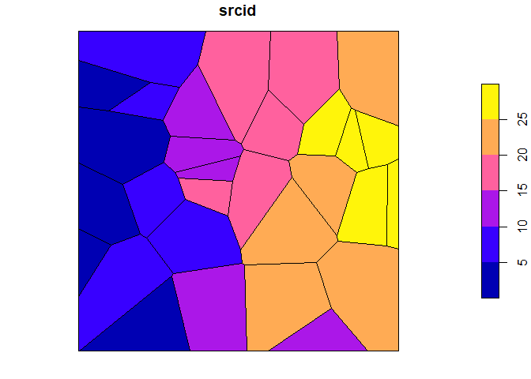
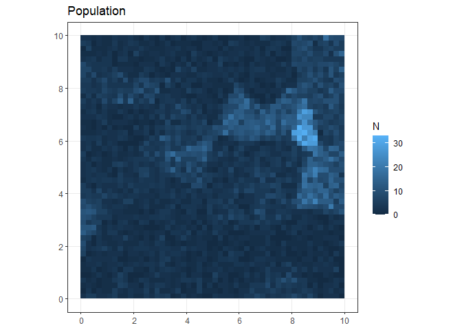
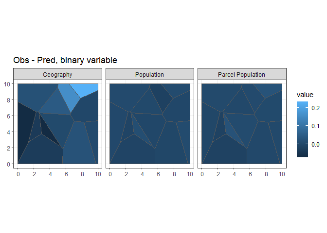

Evaluating Spatagg Methods
================

## Intro

The spatagg package provides several functions to facilitate the
conversion of areal estimates and microdata between non-nesting
geographies. The purpose of this document is to demonstrate the pros and
cons of spatagg methods.

## Set Up

### Boundary

First, an overall geographic boundary is created. This boundary serves
as a sandbox from which smaller non-overlapping sets of geographies are
be generated.

``` r
# Set up libraries
set.seed(1)
library('data.table')
library('sf')
library('dplyr', quietly = TRUE)
library('ggplot2', quietly = TRUE)
library('spatagg')
# given a bottom left corner, create a square
poly_points = function(x, y, step =1){
  mat = matrix(c(x, y, # bottom left
                 x+step, y, # bottom right
                 x+step, y+step, # top right
                 x, y+step, # top left
                 x, y # close
  ),ncol = 2, byrow = TRUE)
}

boundary = poly_points(0,0, 10)
r = sf::st_sfc(sf::st_polygon(list(boundary)))
boundary = sf::st_sf(r, id = 1)
```

### Source and target

Two sets of geographies are created. The first, src (or, source) is the
origin geographic set for the data (to be created later). The second,
tgt (or, target), is the desired geographic level for the estimates.
Both are provided in maps below. They are created by sampling a set of
points within the boundary and then creating a voronoi tessellation
around the points. By design, there are more source polygons than target
ones. This reflects that most instances of non-nesting aggregation go
between a set of geographically smaller source polygons and a larger
(geographically) set of target polygons. For example, Census Tracts to
ZIP codes.

``` r
src = st_sample(boundary, 30)
src = st_sf(geom = src)
src = st_voronoi(do.call(c, src$geom))
src = st_sf(srcid = seq_along(src), geom = st_collection_extract(src))
src = st_intersection(src, boundary)
src$id <- NULL
plot(src[,'srcid'])
```



``` r
tgt = st_sample(boundary, 12)
tgt = st_sf(geom = tgt)
tgt = st_voronoi(do.call(c, tgt$geom))
tgt = st_sf(tgtid = seq_along(tgt), geom = st_collection_extract(tgt))
tgt = st_intersection(tgt, boundary)
tgt$id <- NULL
plot(tgt[,'tgtid'])
```


### Population and variables

The location of “people are randomly generated within the boundary.
These”people” are randomly assigned a binary variable value and a
numeric (count) variable. The src polygon is used to inject some spatial
patterning.

``` r
# Bring in source information to give it some spatial patterning
srcprop = data.table(srcid = src$srcid)
srcprop[, prop := runif(.N, 0, 1) * srcid]
srcprop[prop < max(prop)/2, prop:=max(prop)/2]
srcprop[, npop := round(prop/sum(prop) * 10000)]
srcprop[, binperc := runif(.N)]

src = merge(src, srcprop, all.x = T, by = c('srcid'))
pop = st_sample(src, src$npop)
pop = st_sf(geom = pop, pid = seq_len(length(pop)))
pop = st_intersection(pop, src)

pop = pop %>% group_by(srcid) %>% mutate(bin = sample(0:1, n(), T, c(1-unique(binperc), unique(binperc))))

pop$num = round(runif(nrow(pop), 0, 100) + pop$srcid/2)

plot(pop[, c('pid', 'bin', 'num')])
```


``` r
# Show pop densisty
grid = st_make_grid(boundary, cellsize = .2)
grid = st_sf(gid = seq_along(grid), geom = grid)
pop = st_join(pop, grid)
gpop = pop %>% group_by(gid) %>% st_drop_geometry %>% summarize(N = n())
grid = merge(grid, gpop, all.x = T, by = 'gid')
grid$N[is.na(grid$N)] = 0
ggplot(grid) + geom_sf(aes(fill = N), color = NA) + theme_bw() + ggtitle('Population')
```



### Aggregate to source

The maps below show the “true” values for the `bin` and `num` variables
at the source geography level.

``` r
srcp = pop %>% st_drop_geometry() %>% group_by(srcid) %>% summarize(bin = mean(bin), num = sum(num))
src = merge(src[, c('srcid', 'npop','binperc')], srcp, all.x = T, by = 'srcid')

plot(src[, c('bin', 'num')])
```


### Aggregate to target

The maps below show the “true” values of `bin` and `num` at the target
geography level. The resulting values are what will serve as the
observed truth when evaluating the various types of spatial
crosswalking.

``` r
tgtp = pop %>% st_intersection(tgt) %>% st_drop_geometry() %>% group_by(tgtid) %>% summarize(bin = mean(bin), num = sum(num))
tgt = merge(tgt, tgtp, all.x = T, by = 'tgtid')
plot(tgt[, c('bin', 'num')])
```


## Compute and apply crosswalks

### Geographic Crosswalks

Geographic crosswalks distribute values from source to target based on
geographic overlap. For the `num` variable, a source polygon contributes
the percent overlap to a given target. For example, a source polygon
that has 30% of its area overlapping a given target polygon will
contribute `.3 * num` to the final estimate for target. The target
polygon `bin` value is computed slightly differently. Instead, source
polygon contributes its value based on the relative overlap with target.
For example, a source polygon’s area may overlap 30% with the target
polygon, but only cover 10% of the target polygon. As such, the
resulting weight of the source to target pairing is 10%. By weighting in
terms of relative share of target, \[0-1\] bounding for binary variables
(or percents or proportions or whatever) will be preserved.

Geographic crosswalks can be considered a special case of population
crosswalks with the assumption that population is equally distributed
within a source polygon.

``` r
s2t = create_xwalk(source = src, target = tgt, source_id = 'srcid', target_id = 'tgtid',method = 'fractional overlap')
tgt_gb = crosswalk(src, 'srcid', 'bin', proportion = T, xwalk_df = s2t, rescale = T)
tgt_gn = crosswalk(src, 'srcid', 'num', proportion = F, xwalk_df = s2t, rescale = F)

tgt_g = merge(tgt_gb, tgt_gn, all.x = T, by = 'target_id')
setDT(tgt_g)
setnames(tgt_g, c('tgtid', 'gbin', 'gnum'))
```

### Population based crosswalk

This set of crosswalk weights are generated based on the relative
overlap of population between source and target. The caveats between
count and proportion data discussed above apply here as well.

Note: there is no reason to use the spatagg package if your data are
available at the point level. This example exists as an idealized case.
More generally, you are going to have some sort of areal population
expressed as points (see below). That is really what the ‘point pop’
method is for.

``` r
pop$pop = 1

s2t_pop = create_xwalk(source = src, target = tgt, source_id = 'srcid', target_id = 'tgtid',method = 'point pop', point_pop = pop)
tgt_pb = crosswalk(src, 'srcid', 'bin', proportion = T, xwalk_df = s2t_pop)
tgt_pn = crosswalk(src, 'srcid', 'num', proportion = F, xwalk_df = s2t_pop)

tgt_p = merge(tgt_pb, tgt_pn, all.x = T, by = 'target_id')
setDT(tgt_p)
setnames(tgt_p, c('tgtid', 'pbin', 'pnum'))
```

### Approximate parcel population

Usually, point population locations and values will be a point based
(e.g. centriod) representation of small area. In this case, a few
thousand points are distributed within the boundary and population
points are aggregated to the closet one. This is to roughly approximate
the parcel population estimates made available in the kcparcelpop
package. This also reflects how people actually live– in buildings
shared with other and not entirely randomly distributed throughout
space.

``` r
# sample some points to represent parcels
parcel = st_sample(boundary, 5000)
parcel = st_sf(parcel_id = seq_along(parcel), geom = parcel)

# assign parcel id to pop based on proximity
dist = st_distance(pop, parcel)
dist = apply(dist, 1, which.min)
pop$parcel_id = parcel$parcel_id[dist]
parcelpop = pop %>% group_by(parcel_id) %>% st_drop_geometry() %>% summarise(pop = sum(pop))
parcelpop = merge(parcel, parcelpop, by = 'parcel_id')

# Create xwalk
s2t_ppop = create_xwalk(source = src, target = tgt, source_id = 'srcid', target_id = 'tgtid',method = 'point pop', point_pop = parcelpop)
tgt_ppb = crosswalk(src, 'srcid', 'bin', proportion = T, xwalk_df = s2t_ppop, rescale = T)

tgt_ppn = crosswalk(src, 'srcid', 'num', proportion = F, xwalk_df = s2t_ppop, rescale = F)
tgt_pp = merge(tgt_ppb, tgt_ppn, all.x = T, by = 'target_id')
setDT(tgt_pp)
setnames(tgt_pp, c('tgtid', 'ppbin', 'ppnum'))
```

### Compare results

Generally, the higher the spatial resolution of the population data the
more accurate (in this case, by a lower RMSE) the resulting
aggregated/crosswalked estimates are to the “truth.”

``` r
res = tgt %>% st_drop_geometry()
res = merge(res, tgt_g, all.x = T, by = 'tgtid')
res = merge(res, tgt_p, all.x = T, by = 'tgtid')
res = merge(res, tgt_pp, all.x = T, by = 'tgtid')
setDT(res)


# Compute overall root mean squared error and report
rmse = function(obs, pred) round(sqrt(mean((obs - pred)^2)),3)
chk = rbind(
  res[, .(Var = 'bin', Pop = rmse(bin, pbin), Geog = rmse(bin, gbin), `Parcel Pop` = rmse(bin, ppbin))],
  res[, .(Var = 'num', Pop = rmse(num, pnum), Geog = rmse(num, gnum), `Parcel Pop` = rmse(num, ppnum))]
  )
knitr::kable(chk)
```

| Var |     Pop |     Geog | Parcel Pop |
|:----|--------:|---------:|-----------:|
| bin |   0.008 |    0.089 |      0.013 |
| num | 482.416 | 1131.473 |    696.832 |

``` r
# maps showing target_id specific difference
blah = melt(res, id.vars = c('tgtid', 'bin', 'num'), 
            measure.vars = list(c('gbin', 'pbin', 'ppbin'), c('gnum', 'pnum', 'ppnum')),
            value.name = c('ebin', 'enum'))
blah[, variable := factor(variable, 1:3, c('Geography', 'Population', 'Parcel Population'))]
blah[, bin_dif := bin-ebin][,num_dif := num-enum]
blah = melt(blah[, .(tgtid, type = variable, bin_dif, num_dif)], id.vars = c('tgtid', 'type'))
blah = merge(tgt, blah, by = 'tgtid')

ggplot(filter(blah,variable == 'bin_dif')) +
  geom_sf(aes(fill = value)) + 
  facet_wrap(~type) +
  theme_bw() +
  ggtitle('Obs - Pred, binary variable')
```



``` r
ggplot(filter(blah,variable == 'num_dif')) +
  geom_sf(aes(fill = value)) + 
  facet_wrap(~type) +
  theme_bw() +
  ggtitle('Obs - Pred, count variable')
```


### Sensitivity testing the parcel approximation approach

This set of sensitivity analyses (20 rounds of parcel population
creation for a varying number of parcels) examines how changes in the
number of parcels (or population clusters) changes the error in this
example relative to the geographic overlap approach. For binary type
variables, it seems (at least based on these tests) that using parcel
population approach is nearly always better while for numeric variables
(e.g. counts) a certain point density is required.

``` r
# A function to generate parcel population results
gen_parcels = function(boundary, pop, src, tgt, N){
  # sample some points to represent parcels
  parcel = st_sample(boundary, N)
  parcel = st_sf(parcel_id = seq_along(parcel), geom = parcel)
  
  # assign parcel id to pop based on proximity
  dist = st_distance(pop, parcel)
  dist = apply(dist, 1, which.min)
  pop$parcel_id = parcel$parcel_id[dist]
  parcelpop = pop %>% group_by(parcel_id) %>% 
    st_drop_geometry() %>% 
    summarise(pop = sum(pop))
  parcelpop = merge(parcel, parcelpop, by = 'parcel_id')
  
  # Create xwalk
  s2t_ppop = create_xwalk(source = src, target = tgt, 
                          source_id = 'srcid', target_id = 'tgtid',
                          method = 'point pop', point_pop = parcelpop)
  tgt_ppb = crosswalk(src, 'srcid', 'bin', 
                      proportion = T, xwalk_df = s2t_ppop, rescale = T)
  
  tgt_ppn = crosswalk(src, 'srcid', 'num', 
                      proportion = F, xwalk_df = s2t_ppop, rescale = F)
  tgt_pp = merge(tgt_ppb, tgt_ppn, all.x = T, by = 'target_id')
  setDT(tgt_pp)
  setnames(tgt_pp, c('tgtid', 'ppbin', 'ppnum'))
  
  tgt_pp = merge(tgt_pp, tgt[, c('tgtid', 'bin', 'num'), drop = T], by = 'tgtid')
  tgt_pp[, .(err_bin = rmse(bin, ppbin), err_num = rmse(num, ppnum))]
}

tgrid = CJ(iter = 1:20, size = c(100, 1000, 2000, 3000, 5000, 7000))
tgrid[, id := .I]
tgrid = split(tgrid, by = 'id')
ptests = lapply(tgrid, function(tg){
  
  r = gen_parcels(boundary, pop, src, tgt, N = tg$size)
  r = cbind(r, tg)
  return(r)
  
})

ptests = rbindlist(ptests)

ptests_err = rbind(ptests[, .(
  m = mean(err_bin),
  l = quantile(err_bin, .025),
  u = quantile(err_bin, .975),
  var = 'bin'
), size],
ptests[, .(
  m = mean(err_num),
  l = quantile(err_num, .025),
  u = quantile(err_num, .975),
  var = 'num'
), by = .(size)])

g = ggplot(ptests_err[var == 'num'], aes(x = size, y = m, ymin =l, ymax = u)) + 
  geom_line() +
  geom_ribbon(alpha = .4) +
  theme_bw() +
  ggtitle('Error of num by number of parcels') +
  ylab('RMSE') +
  geom_hline(data = chk[Var == 'num', .(Geog)], aes(yintercept = Geog), color = 'purple')
g
```


``` r
g = ggplot(ptests_err[var == 'bin'], aes(x = size, y = m, ymin =l, ymax = u)) + 
  geom_line() +
  geom_ribbon(alpha = .4) +
  theme_bw() +
  ggtitle('Error of bin by number of parcels') +
  ylab('RMSE')+
  geom_hline(data = chk[Var == 'bin', .(Geog)], aes(yintercept = Geog), color = 'purple')
g
```


## A ‘real’ data example

Our real data examples will be examining the percent of deaths between
2018 and 2020 that were due to diabetes and the count of deaths due all
drugs during that period. The source geography will be tracts and the
target geography will be HRAs. Records that are not geocoded within King
County are omitted from the analysis.

### The data

In the extract, there are 40,946 deaths from all causes, 1,221 from
diabetes and 1,204 from all drugs.


### The truth

``` r
# Tract level
tract = st_transform(tract, st_crs(deaths))
dtract = st_join(deaths, tract[,'GEOID'])
dtract = dtract %>% 
  st_drop_geometry() %>% 
  group_by(GEOID) %>%
  summarize(diabetes = sum(diabetes,na.rm =T),
            drugs = sum(all_drugs, na.rm = T),
            all = n())

dtract = dtract %>% mutate(pdiabetes := diabetes/all)

# HRA

dhra = st_join(deaths, hra[,'id']) %>%
  st_drop_geometry() %>%
  group_by(id) %>%
   summarize(diabetes = sum(diabetes,na.rm =T),
            drugs = sum(all_drugs, na.rm = T),
            all = n())%>% 
  mutate(pdiabetes := diabetes/all) %>%
  filter(!is.na(id))
```

### Crosswalks

``` r
geog = create_xwalk(tract, hra, 'GEOID', 'id', method = 'fractional overlap')
ppop = create_xwalk(tract, hra, 'GEOID', 'id', method = 'point pop', point_pop = kcparcelpop::parcel_pop)
ppop = ppop %>% filter(isect_amount >0)

# go from tract to hra
t2hra = function(dtract, xw,  type = 'geog'){
  
  r = lapply(c('diabetes', 'drugs', 'all', 'pdiabetes'), function(x){
    
    d = crosswalk(dtract, 'GEOID', est = x, 
              proportion = x == 'pdiabetes', 
              xwalk_df = xw)
    
    d$var = x
    
    d
    
  })
  
  r = rbindlist(r)
  r = dcast(r, target_id ~ var, value.var = 'est')
  r[, 'type' := type]
  
  r
}

rgeog = t2hra(dtract, geog, 'geog')
rppop = t2hra(dtract, ppop, 'ppop')

# compute rmse for stuff
compare_to_truth = function(obs, pred){
  pred = copy(pred)
  setnames(pred, 
           c('diabetes', 'drugs', 'all', 'pdiabetes'),
           c('e_diabetes', 'e_drugs', 'e_all', 'e_pdiabetes')
           )
  
  r = merge(obs, pred, all.x = T, by.x = 'id', by.y = 'target_id')
  setDT(r)
  
  # convert two counts, and then compute
  r[, e_pdiabetes2 := e_diabetes/e_all]
  
  # compute RMSEs
  e = r[, .(all = rmse(all, e_all),
        diabetes = rmse(diabetes, e_diabetes),
        drugs = rmse(drugs, e_drugs),
        pdiabetes = rmse(pdiabetes, e_pdiabetes),
        pdiabetes2 = rmse(pdiabetes, e_pdiabetes2)), type]
  e
  
}

cgeog = compare_to_truth(dhra, rgeog)
cppop = compare_to_truth(dhra, rppop)

knitr::kable(rbind(cgeog, cppop))
```

| type |    all | diabetes | drugs | pdiabetes | pdiabetes2 |
|:-----|-------:|---------:|------:|----------:|-----------:|
| geog | 86.592 |    3.051 | 2.148 |     0.008 |      0.003 |
| ppop | 35.411 |    1.795 | 1.313 |     0.004 |      0.002 |

As the table shows, parcel population has lower overall error across all
indicators.

``` r
dhra = merge(dhra, rgeog[, .(id = target_id, geog_all = all)], all.x = T, by = 'id')

dhra = merge(dhra, rppop[, .(id = target_id, ppop_all = all)], all.x = T, by = 'id')

setDT(dhra)
ghra = melt(dhra[, .(id, all, geog_all, ppop_all)], id.vars = c('id', 'all'))
ghra[, dif := all - value]
ghra[, variable := factor(variable, c('geog_all', 'ppop_all'), c('Geographic', 'Parcel Pop'))]
ghra = merge(ghra, hra[, 'id'], by = 'id')
ghra = st_as_sf(ghra)

ggplot(ghra, aes(fill = dif)) + 
  geom_sf() + 
  facet_wrap(~variable) +
  scale_fill_viridis_c() +
  theme_bw() +
  ggtitle('Obs - Pred by crosswalk type', 'All deaths') +
  theme(axis.text = element_blank(),
        axis.ticks = element_blank(),
        panel.grid = element_blank())
```


