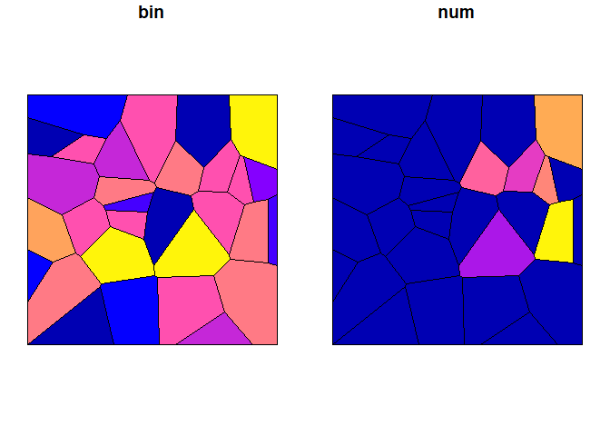
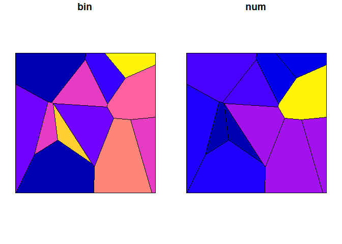

Evaluating Spatagg Methods
================

## Intro

The spatagg package provides several functions to facilitate the
conversion of areal estimates and microdata between non-nesting
geographies. The purpose of this document is to demonstrate the pros and
cons of spatagg methods.

## Set Up

### Boundary

First, we create an overall geographic boundary from which smaller
non-overlapping sets of geographies will be generated.

``` r
# Set up libraries
library('data.table')
library('sf')
library('dplyr', quietly = TRUE)
library('ggplot2', quietly = TRUE)
# given a bottom left corner, create a square
poly_points = function(x, y, step =1){
  mat = matrix(c(x, y, # bottom left
                 x+step, y, # bottom right
                 x+step, y+step, # top right
                 x, y+step, # top left
                 x, y # close
  ),ncol = 2, byrow = TRUE)
}

boundary = poly_points(0,0, 10)
r = sf::st_sfc(sf::st_polygon(list(boundary)))
boundary = sf::st_sf(r, id = 1)
```

### Source and target

Two sets of geographies will be created. The first, src (or, source)
will be the origin geographic set for the data (to be created later).
The second, tgt(or, target), is the desired geographic level for the
estimates.

``` r
src = st_sample(boundary, 30)
src = st_sf(geom = src)
src = st_voronoi(do.call(c, src$geom))
src = st_sf(srcid = seq_along(src), geom = st_collection_extract(src))
src = st_intersection(src, boundary)
src$id <- NULL
plot(src[,'srcid'])
```


``` r
tgt = st_sample(boundary, 12)
tgt = st_sf(geom = tgt)
tgt = st_voronoi(do.call(c, tgt$geom))
tgt = st_sf(tgtid = seq_along(tgt), geom = st_collection_extract(tgt))
tgt = st_intersection(tgt, boundary)
tgt$id <- NULL
plot(tgt[,'tgtid'])
```


### Population and variables

Randomly generate the location of “people” within the boundary. Randomly
assign the people a binary condition and numeric one. Spatial patterning
derives from src

``` r
# Bring in source information to give it some spatial patterning
srcprop = data.table(srcid = src$srcid)
srcprop[, prop := runif(.N, 0, 1) * srcid]
srcprop[prop < max(prop)/2, prop:=max(prop)/2]
srcprop[, npop := round(prop/sum(prop) * 10000)]
srcprop[, binperc := runif(.N)]

src = merge(src, srcprop, all.x = T, by = c('srcid'))
pop = st_sample(src, src$npop)
pop = st_sf(geom = pop, pid = seq_len(length(pop)))
pop = st_intersection(pop, src)

pop = pop %>% group_by(srcid) %>% mutate(bin = sample(0:1, n(), T, c(1-unique(binperc), unique(binperc))))

pop$num = round(runif(nrow(pop), 0, 100) + pop$srcid/2)

plot(pop[, c('pid', 'bin', 'num')])
```


``` r
# Show pop densisty
grid = st_make_grid(boundary, cellsize = .2)
grid = st_sf(gid = seq_along(grid), geom = grid)
pop = st_join(pop, grid)
gpop = pop %>% group_by(gid) %>% st_drop_geometry %>% summarize(N = n())
grid = merge(grid, gpop, all.x = T, by = 'gid')
grid$N[is.na(grid$N)] = 0
ggplot(grid) + geom_sf(aes(fill = N), color = NA) + theme_bw() + ggtitle('Population')
```


### Aggregate to source

``` r
srcp = pop %>% st_drop_geometry() %>% group_by(srcid) %>% summarize(bin = mean(bin), num = mean(num))
src = merge(src[, c('srcid', 'npop','binperc')], srcp, all.x = T, by = 'srcid')

plot(src[, c('bin', 'num')])
```



### Aggregate to target

``` r
tgtp = pop %>% st_intersection(tgt) %>% st_drop_geometry() %>% group_by(tgtid) %>% summarize(bin = mean(bin), num = sum(num))
tgt = merge(tgt, tgtp, all.x = T, by = 'tgtid')
plot(tgt[, c('bin', 'num')])
```



## Compute and apply crosswalks

### Geographic Crosswalks

``` r
library('spatagg')
s2t = create_xwalk(source = src, target = tgt, source_id = 'srcid', target_id = 'tgtid',method = 'fractional overlap')
tgt_gb = crosswalk(src, 'srcid', 'bin', proportion = T, xwalk_df = s2t, rescale = T)
tgt_gn = crosswalk(src, 'srcid', 'num', proportion = F, xwalk_df = s2t, rescale = F)

tgt_g = merge(tgt_gb, tgt_gn, all.x = T, by = 'target_id')
setDT(tgt_g)
setnames(tgt_g, c('tgtid', 'gbin', 'gnum'))
```

### Population based crosswalk

``` r
pop$pop = 1

s2t_pop = create_xwalk(source = src, target = tgt, source_id = 'srcid', target_id = 'tgtid',method = 'point pop', point_pop = pop)
tgt_pb = crosswalk(src, 'srcid', 'bin', proportion = T, xwalk_df = s2t_pop)
tgt_pn = crosswalk(src, 'srcid', 'num', proportion = F, xwalk_df = s2t_pop)

tgt_p = merge(tgt_pb, tgt_pn, all.x = T, by = 'target_id')
setDT(tgt_p)
setnames(tgt_p, c('tgtid', 'pbin', 'pnum'))
```

### Approximate parcel population

``` r
# sample some points to represent parcels
parcel = st_sample(boundary, 6000)
parcel = st_sf(parcel_id = seq_along(parcel), geom = parcel)

# assign parcel id to pop based on proximity
dist = st_distance(pop, parcel)
dist = apply(dist, 1, which.min)
pop$parcel_id = parcel$parcel_id[dist]
parcelpop = pop %>% group_by(parcel_id) %>% st_drop_geometry() %>% summarise(pop = sum(pop))
parcelpop = merge(parcel, parcelpop, by = 'parcel_id')

# Create xwalk
s2t_ppop = create_xwalk(source = src, target = tgt, source_id = 'srcid', target_id = 'tgtid',method = 'point pop', point_pop = parcelpop)
tgt_ppb = crosswalk(src, 'srcid', 'bin', proportion = T, xwalk_df = s2t_ppop, rescale = T)

tgt_ppn = crosswalk(src, 'srcid', 'num', proportion = F, xwalk_df = s2t_ppop, rescale = F)
tgt_pp = merge(tgt_ppb, tgt_ppn, all.x = T, by = 'target_id')
setDT(tgt_pp)
setnames(tgt_pp, c('tgtid', 'ppbin', 'ppnum'))
```

### Compare results

``` r
res = tgt %>% st_drop_geometry()
res = merge(res, tgt_g, all.x = T, by = 'tgtid')
res = merge(res, tgt_p, all.x = T, by = 'tgtid')
res = merge(res, tgt_pp, all.x = T, by = 'tgtid')
setDT(res)


# Compute overall root mean squared error and report
rmse = function(obs, pred) round(sqrt(mean((obs - pred)^2)),3)
chk = rbind(
  res[, .(Var = 'bin', Pop = rmse(bin, pbin), Geog = rmse(bin, gbin), `Parcel Pop` = rmse(bin, ppbin))],
  res[, .(Var = 'num', Pop = rmse(num, pnum), Geog = rmse(num, gnum), `Parcel Pop` = rmse(num, ppnum))]
  )
knitr::kable(chk)
```

| Var |       Pop |      Geog | Parcel Pop |
|:----|----------:|----------:|-----------:|
| bin |     0.008 |     0.088 |       0.01 |
| num | 55841.562 | 55841.881 |   55842.17 |

``` r
# maps showing target_id specific difference
blah = melt(res, id.vars = c('tgtid', 'bin', 'num'), 
            measure.vars = list(c('gbin', 'pbin', 'ppbin'), c('gnum', 'pnum', 'ppnum')),
            value.name = c('ebin', 'enum'))
blah[, variable := factor(variable, 1:3, c('Geography', 'Population', 'Parcel Population'))]
blah[, bin_dif := bin-ebin][,num_dif := num-enum]
blah = melt(blah[, .(tgtid, type = variable, bin_dif, num_dif)], id.vars = c('tgtid', 'type'))
blah = merge(tgt, blah, by = 'tgtid')

ggplot(filter(blah,variable == 'bin_dif')) +
  geom_sf(aes(fill = value)) + 
  facet_wrap(~type) +
  theme_bw() +
  ggtitle('Obs - Pred, binary variable')
```


``` r
ggplot(filter(blah,variable == 'num_dif')) +
  geom_sf(aes(fill = value)) + 
  facet_wrap(~type) +
  theme_bw() +
  ggtitle('Obs - Pred, count variable')
```


